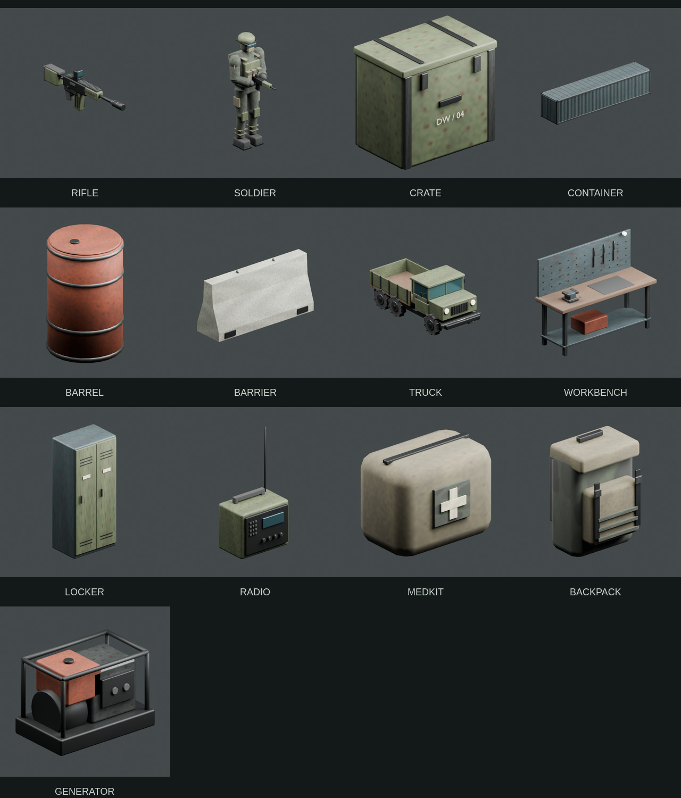

# DEADWIRE

**Go in. Get out. Get paid.**

DEADWIRE is an open-source, single-player extraction-shooter prototype built with
TypeScript and Three.js. Prepare in a walkable hideout, enter an occupied industrial
sector, recover supplies and intelligence, and extract with what you can carry.
Death costs the equipment you brought into the field.

The project includes a local Blender art factory and a reusable agent skill for
creating assets for other games. It is an early playable foundation for contributors,
not a finished commercial game or a recreation of Call of Duty. Its code, world,
lore, and procedural artwork are original.



## Play locally

Install Node.js **22.12 or newer**, then:

```bash
git clone https://github.com/ErikBurdett/deadwire.git
cd deadwire
npm ci
npm run dev
```

Open the local URL printed by Vite. A desktop browser with WebGL 2, a keyboard,
and a mouse is required. Chromium is the tested browser. **Blender is optional for
playing**: the reviewed game assets are included in the repository.

Click **Deploy to Blackwater** for a raid or **Walk the hideout** to visit its stations.
The game captures your mouse during play. Press Tab or Escape to open the menu.

| Control                   | Action                                      |
| ------------------------- | ------------------------------------------- |
| WASD / mouse              | Move / look                                 |
| Left / right mouse button | Fire / aim                                  |
| Shift / C or Ctrl / Space | Sprint / crouch / jump                      |
| E / R / H                 | Interact and loot / reload / use trauma kit |
| M / I                     | Tactical map / backpack                     |
| Tab or Escape             | Menu and pause                              |
| Arrow keys                | Alternative camera controls                 |

Progress is saved in this browser's local storage. Closing during a raid preserves
that same raid; it does not safely extract your kit. Menus pause this local solo game.
There is no account, server, multiplayer, or cloud save.

## What's playable

- Walkable hideout, equipment stash, buying and selling, and a weapon workbench.
- Five weapon stat profiles and optic, muzzle, and magazine modifications.
- A 480 × 480-meter sector with eight locations, 15 enterable buildings, 57 loot
  caches, and 30 active garrison soldiers.
- Patrol, investigate, combat, and search behaviors, wall-blocked shots, lootable bodies.
- Cash, weapons, armor, attachments, valuables, ammunition, trauma kits, and eight lore notes.
- Three free edge extraction zones: stay inside for seven seconds to extract.
- Menu-called extraction requires **more than $200 in carried cash** and costs $200.
  Reach its nearby landing zone, wait 35 seconds for the aircraft, then remain for
  eight seconds to board. Nearby patrols investigate the call.
- Persistent cash and gear, extracted-document archive, permanent hideout upgrades,
  and loss of carried equipment on death. An emergency sidearm prevents a softlock.
- A 22-minute raid limit, seeded loot and patrol initialization, deterministic simulation,
  and versioned saved continuation.

See [implementation status](docs/IMPLEMENTATION_STATUS.md) for evidence and known limits.
The current soldier is an articulated polygon model, all five weapon profiles share
one rifle mesh, scenery collision is incomplete, and AI uses local avoidance rather
than a navmesh. These are useful areas for contribution.

## Development checks

```bash
npm run typecheck
npm run format:check
npm test
npm run art:validate
npm run art:test
npm run build
npx playwright install chromium
npm run test:e2e
```

Linux CI may need `npx playwright install --with-deps chromium`. To use an existing
Chromium installation, set `PLAYWRIGHT_CHROMIUM_EXECUTABLE=/path/to/chromium`.
Browser tests start an isolated server on port 5187 and use real keyboard and mouse
controls. `npm run format` formats application source, tests, and project documentation.
A production build is written to `dist/`; serve it with `npm run preview`.

## Blender art factory

For shared workflows across games and machines, use the separate
[Blender Art Factory](https://github.com/ErikBurdett/blender-art-factory). It includes
this military pack, three Theandril art profiles, and eight portable workflow skills.

Blender 5.2.1 is the tested authoring version. Python 3.10+ runs the factory CLI.
`BLENDER_BIN` can point to a Blender installation if it is not on `PATH`.

```bash
npm run art:doctor
python3 scripts/art_factory.py build --asset crate
python3 scripts/art_factory.py validate --asset crate
# Inspect assets/previews/crate.png, the editable source, and the game.
python3 scripts/art_factory.py review --asset crate --decision approve --reviewer "Your name" --notes "Your actual visual findings"
python3 scripts/art_factory.py publish --asset crate
```

The factory retains editable `.blend` files, candidate GLBs, preview renders,
provenance, and exact reviewed snapshots. Technical validation does not approve
artwork. Builds do not overwrite published runtime files until a reviewed candidate
is explicitly published. Optional Blender MCP supports interactive authoring;
repeatable background builds work without MCP or paid services.

Read the [factory guide](docs/ART_FACTORY.md) and
[reusable skill instructions](docs/REUSABLE_SKILLS.md). Included runtime assets make
ordinary game development independent of Blender or external asset APIs.

## Contribute

Start with [CONTRIBUTING.md](CONTRIBUTING.md). Small, tested improvements are welcome:
character and weapon art, animation, AI navigation, scenery collision, rendering
performance, accessibility, encounter design, and stronger gameplay tests.

| Location                           | Responsibility                                      |
| ---------------------------------- | --------------------------------------------------- |
| `src/sim.ts`                       | Canonical raid rules, inventory, economy, AI, saves |
| `src/map.ts`                       | Sector layout, collision geometry, ray visibility   |
| `src/content.ts`                   | Items, weapon stats, upgrades, original lore        |
| `src/scene.ts`                     | Three.js environments, GLB loading, presentation    |
| `src/main.ts`, `src/style.css`     | Controls, menus, HUD, browser storage               |
| `scripts/`                         | Blender generation, review, validation, publication |
| `assets/`, `public/assets/`        | Sources and evidence / published runtime art        |
| `skills/blender-game-art-factory/` | Portable, self-contained factory skill              |
| `tests/`                           | Simulation and browser gameplay checks              |

## License

Code, documentation, and the reusable skill: [MIT](LICENSE).
Original models, textures, and art previews: [CC0 1.0](assets/LICENSE.md).
Dependencies retain their own licenses; see [THIRD_PARTY_NOTICES.md](THIRD_PARTY_NOTICES.md).
This project is not affiliated with or endorsed by Activision or Call of Duty.
